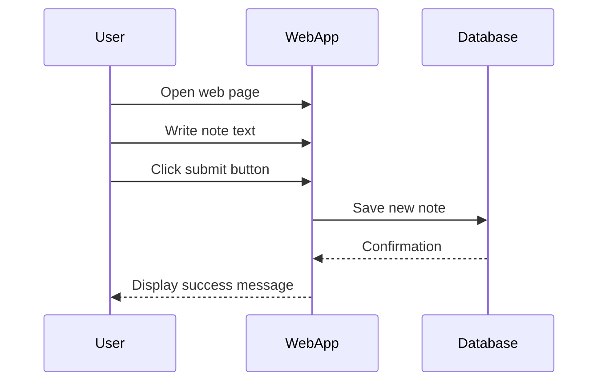

<h1>4-New note diagram.md</h1>

the chain of events caused by opening the page https://studies.cs.helsinki.fi/exampleapp/notes is depicted as a sequence diagram 
The diagram was made as a GitHub Markdown-file using the Mermaid-syntax

