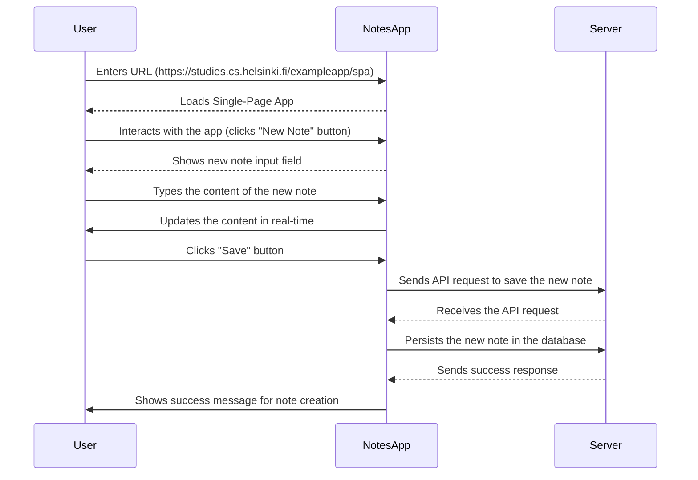

<h1>6-New-note-in-Single-page-app-diagram.md</h1>

```mermaid
sequenceDiagram
  participant User
  participant NotesApp
  participant Server

  User->>NotesApp: Enters URL (https://studies.cs.helsinki.fi/exampleapp/spa)
  NotesApp-->>User: Loads Single-Page App

  User->>NotesApp: Interacts with the app (clicks "New Note" button)
  NotesApp-->>User: Shows new note input field

  User->>NotesApp: Types the content of the new note
  NotesApp->>User: Updates the content in real-time

  User->>NotesApp: Clicks "Save" button
  NotesApp->>Server: Sends API request to save the new note
  Server-->>NotesApp: Receives the API request

  NotesApp->>Server: Persists the new note in the database
  Server-->>NotesApp: Sends success response

  NotesApp->>User: Shows success message for note creation
```
